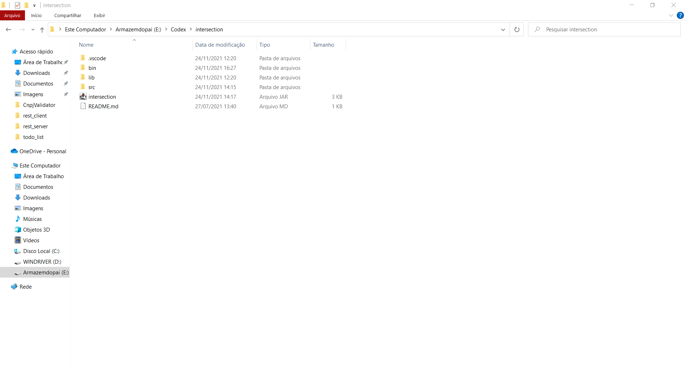
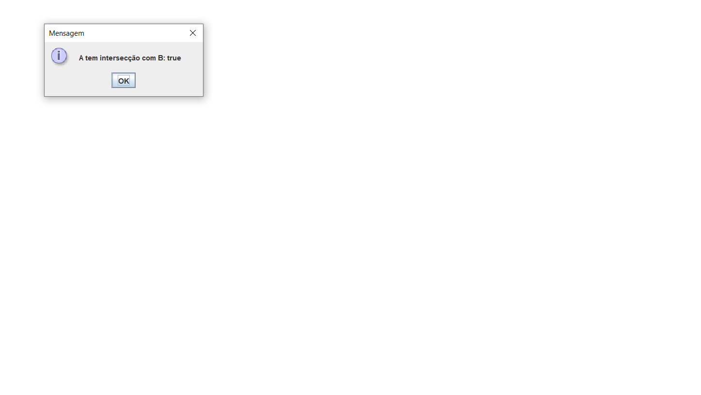
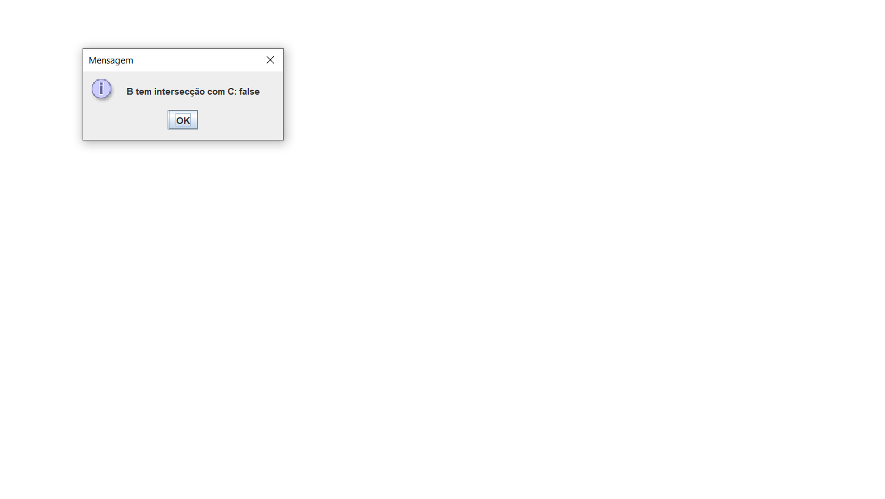

# Como utilizar a aplicação

Para tornar a execução do programa algo fácil, foi criado um executável .jar que pode ser lido por praticamente toda a maquina que possua o javascript instalado.

# Prints exemplificando a execução do programa

<h4 align="left">
  Nos arquivos da aplicação basta encontrar o executável .jar e clicar duas vezes nele para que o programa comece a rodar.
</h4>

<h4 align="left">
   O resultado da intersecção do exemplo irá aparecer
</h4>

