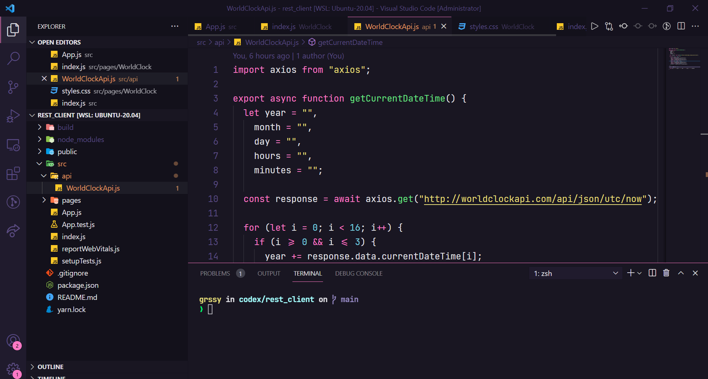
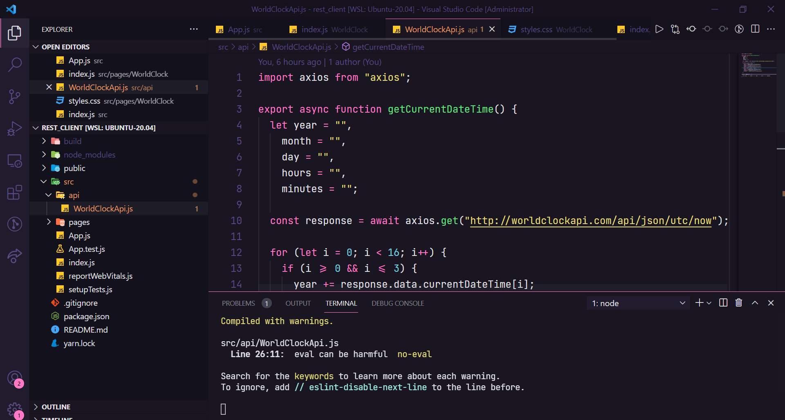
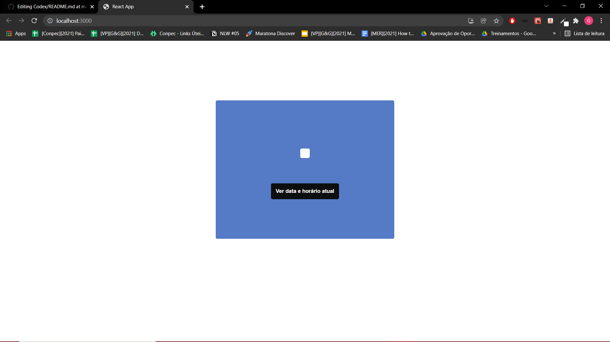
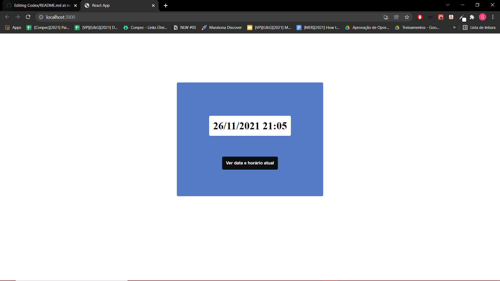

 # Como rodar a aplicação
 
 Para está aplicação é necessário que o usuário tenha instalado as seguintes ferramentas em sua máquina:

 - [NodeJS]
 - [Yarn]

## Instalação do NodeJS na máquina
 
 Neste tutorial será ensinado a instalar o Node nos sistemas Linux, mas a instalação é super simples e pode ser feita pelo seguinte site: https://nodejs.org/en/
 
 1- Abra o terminal de sua preferência e digite o seguinte comando:
 
  sudo apt-get install nodejs
  
para verificar se a instalação foi realizada com sucesso basta digitar o seguinte comando:

  node --version
  
  npm --version
  
 Se aparecer os números das versões então a instalação foi um sucesso.
 
 
## Instalação do Yarn

Neste tutorial será ensinado a instalar o Yarn nos sistemas Linux, mas a instalação é super simples e pode ser acompanhada pelo site: https://yarnpkg.com/

2- Abra o terminal de sua preferência e digite o seguinte comando:

  npm install --global yarn
  

## Exemplificando como rodar a aplicação

Primeiro, pelo terminal ou vscode entre na pasta da aplicação rest_client.

1- Pelo terminal digite o seguinte comando para instalar os pacotes e a node modules:

yarn install

2- Agora digite este comando para rodar a aplicação no local host:

yarn start

3- A aplicação irá aparecer na seguinte url: localhost:3000

4- Clique no botão para que a requisição seja feita e exibida na tela no formato que utilizamos no dia-a-dia.

