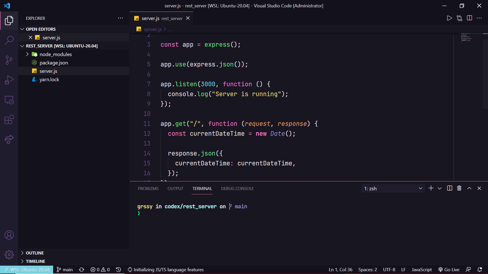
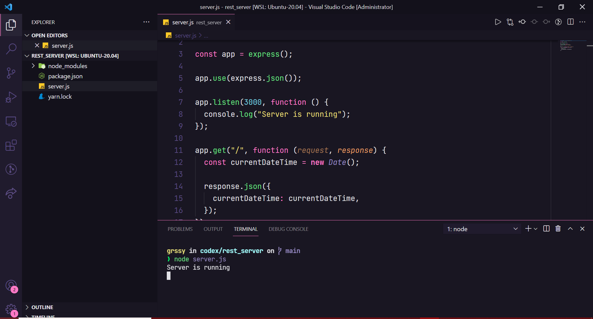
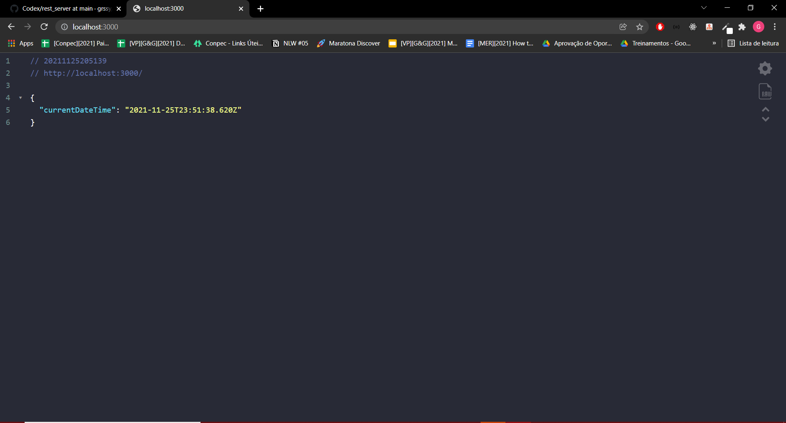

# Como rodar a aplicação

 Para está aplicação é necessário que o usuário tenha instalo na sua maquina as seguintes ferramentas em sua máquina:
 
 -[NodeJS]()
 -[Yarn]()
 
 ## Instalação do NodeJS na máquina
 
 Neste tutorial será ensinado a instalar o Node nos sistemas Linux, mas a instalação é super simples e pode ser feita pelo seguinte site: https://nodejs.org/en/
 
 1- Abra o terminal de sua preferência e digite o seguinte comando:
 
  sudo apt-get install nodejs
  
para verificar se a instalação foi realizada com sucesso basta digitar o seguinte comando:

  node --version
  
  npm --version
  
 Se aparecer os números das versões então a instalação foi um sucesso.
 
 
## Instalação do Yarn

Neste tutorial será ensinado a instalar o Yarn nos sistemas Linux, mas a instalação é super simples e pode ser acompanhada pelo site: https://yarnpkg.com/

2- Abra o terminal de sua preferência e digite o seguinte comando:

  npm install --global yarn
  
  
## Exemplificação do sistema rodando

Após a instalação das ferramentas, basta entrar na pasta do projeto rest_server e digitar os seguintes comandos:

1- Instalar os pacotes da node modules

  yarn install
  
2- Executar o servidor node para o arquivo que está a api

  node server.js
  
  
  
3- Acessar o localhost:3000 e ver que a api está retornando nesta rota um JSON com o currentDateTime.

