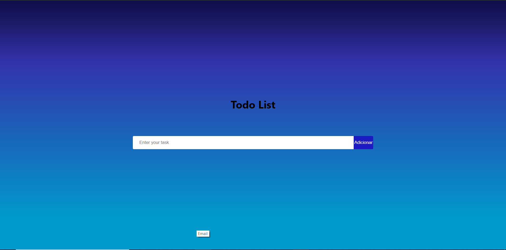
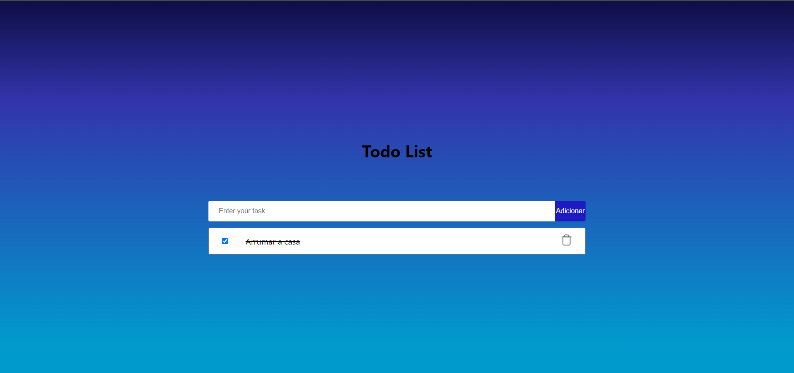
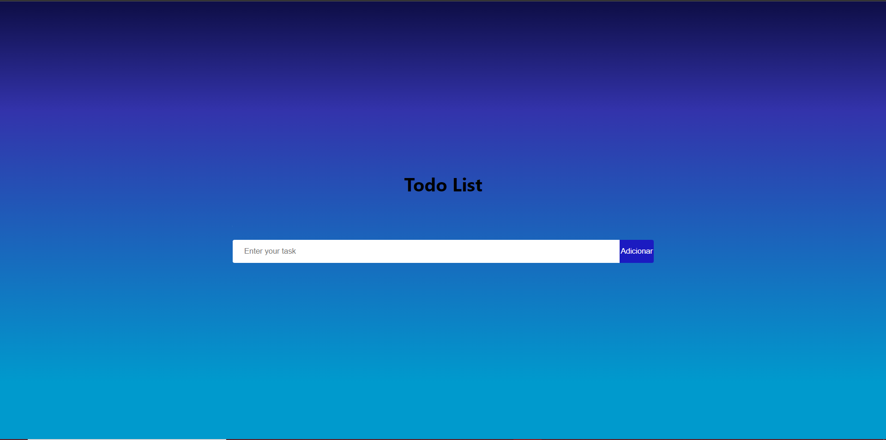

# Como testar a aplicação

Para facilitar a resolução do exercício foi realizado o deploy desta aplicação para o seguinte domínio: https://todo-list-a506d.web.app/

# Prints da utilização da aplicação

<h4 align="left"> 
  Na tela inicial podemos ver uma caixa de texto e um botão dizendo enviar. Basta digitar a sua tarefa e clicar no botão adicionar que a tarefa será registrada no banco de dados e mostrada na tela.
</h4>

<h4 align="left"> 
  Ao escrever na caixa de texto e clicar em adicionar o tarefa é mostrada. Agora podemos marcá-la como feita (CheckBox) ou excluí-la (icone de lixo).
</h4>

<h4 align="left"> 
  É importante citar que a página da aplicação pode ser recarregada e as tarefas não iram sumir, a aplicação garante de sempre trazer de volta tudo do banco.
</h4>

